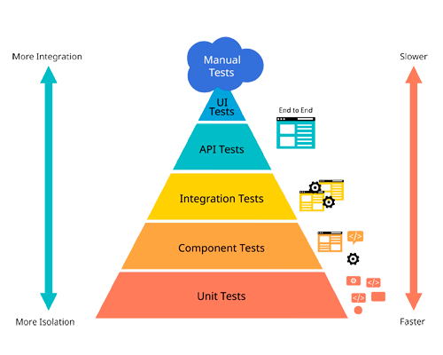

# 🧪 Luna Tasks: Стратегия тестирования и защита бизнес-целей

В мире микросервисов код пишется быстро, а ломается еще быстрее. Когда продукт растет, цена ошибки возрастает экспоненциально. В **Luna Tasks** мы не пишем тесты ради "зеленых галочек" в CI/CD или красивых цифр покрытия (Code Coverage). Мы пишем тесты, чтобы **защитить бизнес-логику** и спать спокойно.



Наша стратегия тестирования строится на двух фундаментальных столпах: **Изолированные бизнес-правила (Unit)** и **Реальная инфраструктура (Integration)**.

---

## 🛡 1. Защита бизнес-правил (Unit Testing)

Бизнес-логика — это самое ценное, что есть в приложении. Это правила, по которым работает продукт. В `Luna Tasks` вся бизнес-логика инкапсулирована в слое `Service`.

Мы используем подход **Table-Driven Tests** (табличные тесты) в связке с моками (`testify/mock`). Это позволяет нам прогнать десятки сценариев через одну функцию, не дублируя код. Слой `Service` не должен знать, какую СУБД мы используем. Мокая интерфейс репозитория, мы тестируем исключительно логику (условия, валидацию, криптографию), делая тесты молниеносными.

**Что мы защищаем? (Примеры из `service_test.go`)**

* **Матрица ролей (RBAC):** Жесткая проверка прав на приглашение новых людей. Успех гарантирован только для `owner` или `admin`. Для `member` или посторонних — жесткий отказ (`insufficient permissions`). Бизнес-цель: не дать рядовому сотруднику добавить в приватную команду посторонних лиц.
* **Изоляция данных (Tenancy):** Проверка взаимодействия пользователя только со своими задачами. Попытка создать задачу или оставить комментарий в чужой команде вызывает ошибку. Бизнес-цель: защита от IDOR-уязвимостей. Данные одного клиента абсолютно изолированы от других.
* **Безопасность аутентификации:** Проверка выдачи токенов (Access + Refresh) только при правильных данных. Неверный пароль или несуществующий логин отдают идентичную ошибку (`invalid credentials`). Бизнес-цель: защита от перебора пользователей (User Enumeration).

---
## 🏗 2. Проверка реальности (Integration Testing)

Юнит-тесты прекрасны, но они слепы. Они не скажут вам, что вы ошиблись в синтаксисе сложного SQL-запроса или забыли создать индекс в базе. Для этого нужны интеграционные тесты.

В `Luna Tasks` мы используем **гибридный подход** к инфраструктуре тестирования. Это позволяет удовлетворить жесткие требования CI/CD пайплайнов к изоляции (через `Testcontainers`) и одновременно обеспечить комфортный Developer Experience (DevEx) при локальной разработке.

Управление окружением происходит автоматически (паттерн Smart Environment) через переменную `CI`.

### 💻 Локальная разработка (Docker Compose)
По умолчанию (когда переменная `CI` не задана), тесты используют выделенное статичное окружение. Это дает предсказуемые порты для дебага через UI-клиенты (DBeaver/DataGrip) во время брейкпоинтов и бережет локальные ресурсы (исключая конфликты гипервизоров вроде WSL2/VirtualBox).

**Как с этим работать локально:**

1. **Поднимаем тестовую инфраструктуру:**
   ```bash
   docker compose -f docker-compose.test.yml up -d
   ```
2. **Запускаем тесты (Zero-Config):**
В коде тестов реализованы умные фолбэки. По умолчанию они используют креды и порты (3306, 6379), которые идентичны настройкам из docker-compose.test.yml. Поэтому для базового запуска достаточно базовой команды:
   ```bash
   go test -v ./...
   ```

(При запуске БД автоматически накатывает миграции и мгновенно очищает таблицы перед каждым тест-сьютом).
3. **Переопределение окружения (Опционально):**
Если стандартные порты на вашей локальной машине уже заняты другой базой, вы можете пробросить другие порты в compose-файле и передать их в тесты через переменные окружения (TEST_DB_HOST, TEST_DB_PORT, TEST_REDIS_PORT и т.д.):
   ```bash
   TEST_DB_PORT=3307 TEST_REDIS_PORT=6380 go test -v ./...
   TEST_DB_HOST=192.168.72.217 TEST_REDIS_HOST=192.168.72.217 go test -v ./...
   ```
4. **Останавливаем окружение после работы:**
   ```bash
   docker compose -f docker-compose.test.yml down -v
   ```

### 🐳 Среда CI/CD (Testcontainers)
Когда код пушится в удаленный репозиторий (например, GitHub Actions) или проверяющий хочет запустить тесты в строгой изоляции, используется переменная окружения `CI=true`.

При наличии этого флага тесты игнорируют внешний `docker-compose` и автоматически поднимают эфемерные контейнеры MySQL 8.0 и Redis 7-alpine прямо из Go-кода с помощью пакета `testcontainers-go`. Контейнеры уничтожаются сразу после выполнения (Graceful Teardown).

**Ручной запуск через Testcontainers (для проверки выполнения ТЗ):**
```bash
CI=true go test -v ./...
```
## 🏗 2. Проверка реальности (Integration Testing)

Юнит-тесты прекрасны, но они слепы. Они не скажут вам, что вы ошиблись в синтаксисе сложного SQL-запроса или забыли создать индекс в базе. Для этого нужны интеграционные тесты.

В `Luna Tasks` мы осознанно отказались от моков уровня БД (`sqlmock`) или динамических библиотек вроде Testcontainers в пользу **выделенного тестового окружения через `docker-compose`**.

Это дает нам предсказуемые статические порты для удобного дебага через UI-клиенты (DBeaver/DataGrip), исключает конфликты локальных гипервизоров и обеспечивает 100% совместимость с Linux-средой в CI/CD пайплайнах.

**Как с этим работать локально:**

1.  Поднимаем тестовую инфраструктуру: `docker compose -f docker-compose.test.yml up -d`
2.  Запускаем тесты: `go test -v ./...` (БД автоматически накатывает миграции и очищается перед каждым тест-сьютом с помощью `TRUNCATE`).
3.  Останавливаем окружение после работы: `docker compose -f docker-compose.test.yml down -v`

**Что мы проверяем на реальной инфраструктуре? (`repository_test.go`)**

* **Сложные SQL-запросы (Аналитика):** Тестирование тяжелых запросов с `JOIN` 3+ таблиц, агрегацией и оконными функциями. Мы заливаем тестовые данные и проверяем корректность подсчета. Бизнес-цель: точные цифры в дашбордах руководителей, исключающие ошибочные управленческие решения.
* **Целостность данных (Foreign Keys & Constraints):** Подтверждение того, что СУБД самостоятельно блокирует некорректные действия (например, привязку задачи к удаленной команде).
* **Кэширование (Redis Cache-Aside):** Имитация рассинхронизации БД и кэша. Мы запрашиваем список задач (промах кэша -> MySQL -> Redis), делаем микро-паузу и стучимся напрямую в контейнер Redis для проверки наличия JSON и корректного TTL. Бизнес-цель: гарантия выживаемости базы данных при пиковых нагрузках.
* **Аудит (Task History):** Смена статуса задачи и проверка автоматического появления записи в таблице `task_history`. Бизнес-цель: безотказный аудиторский след для разрешения спорных ситуаций ("Кто и когда закрыл задачу?").

---

## 🚀 Итог: Пирамида тестирования в действии

Наша стратегия формирует надежную конструкцию: широкое основание из быстрых юнит-тестов покрывает все пограничные случаи бизнес-логики, а крепкая середина из интеграционных тестов с внешним Docker-окружением гарантирует стабильность SQL-запросов и слоя кэширования. Это позволяет рефакторить код с полной уверенностью, что бизнес-цели продукта находятся под надежной защитой.